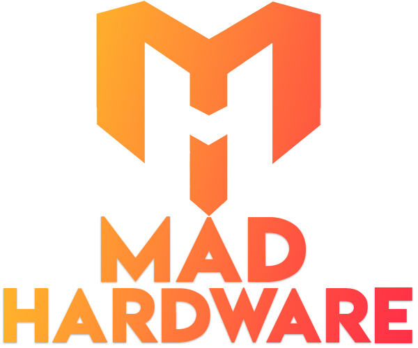

[](https://standardjs.com)
[](https://github.com/sanchis/Madhardware/actions/workflows/main.yml)
<p align="center" >
  
</p>

# About
The purpose of the project is to be able to compare hardware products between different online stores in Spain. The idea is to be able to get the best price for the product you are looking for.


This is a [Next.js](https://nextjs.org/) project bootstrapped with [`create-next-app`](https://github.com/vercel/next.js/tree/canary/packages/create-next-app).

## Getting Started

First, run the development server:

```bash
npm run dev
# or
yarn dev
```

Open [http://localhost:3000](http://localhost:3000) with your browser to see the result.

You can start editing the page by modifying `pages/index.js`. The page auto-updates as you edit the file.

The `pages/api` directory is mapped to `/api/*`. Files in this directory are treated as [API routes](https://nextjs.org/docs/api-routes/introduction) instead of React pages.

## Learn More

To learn more about Next.js, take a look at the following resources:

- [Next.js Documentation](https://nextjs.org/docs) - learn about Next.js features and API.
- [Learn Next.js](https://nextjs.org/learn) - an interactive Next.js tutorial.

You can check out [the Next.js GitHub repository](https://github.com/vercel/next.js/) - your feedback and contributions are welcome!

# Contributors 💪👏
<a href="https://github.com/sanchis/madhardware/graphs/contributors" >
  
</a>
[khushab](https://github.com/khushab)

Made with [contributors-img](https://contrib.rocks).
